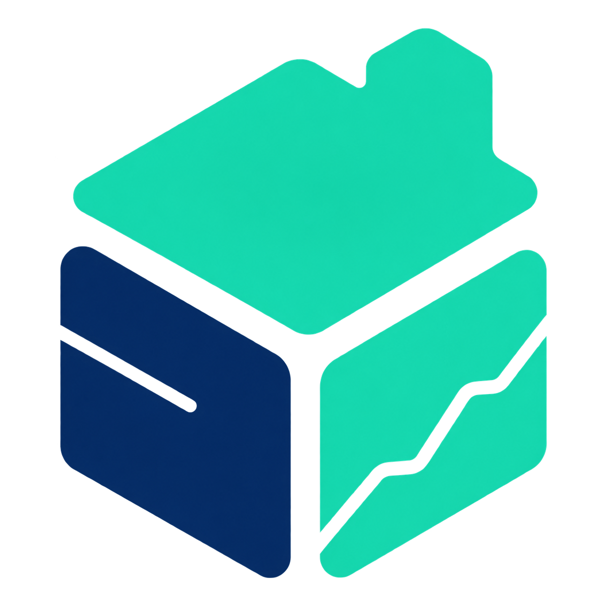

# Topbase

[](https://github.com/frontitle/Topbase/actions/workflows/ci.yml)
[](LICENSE)
[](CHANGELOG.md)

> **看见数据，理解业务，沉淀增长。**



Topbase 是一站式数据分析与可视化数仓平台，让团队通过连接数据、可视化分析、仪表盘观测和周期物化，把业务问题转化为持续可用的数据资产。


_截图使用模拟零售数据，仅用于展示仪表盘的指标、趋势、结构和明细分析能力。_

## 核心功能

- **连接数据**：支持 PostgreSQL、MySQL / MariaDB、ClickHouse、SQL Server、Oracle 和 SQLite，提供连接测试、SSL 与 SSH 跳板机接入。
- **可视化分析**：无需编写 SQL，即可通过字段选择、筛选、汇总、排序、跨表关联和自定义列完成分析；熟悉 SQL 的用户也可以切换到代码模式。
- **指标可视化**：将分析结果快速转换为数字、折线图、面积图、柱状图、条形图、饼图、散点图和明细表格。
- **仪表盘观测**：自由组合分析与内容组件，配置筛选联动、主题、布局、分享、嵌入、订阅和告警，持续追踪核心指标。
- **数据沉淀**：把需要周期统计的分析配置为计划任务，将结果物化到数仓表，并通过目录和血缘持续管理数据资产。
- **分析协作**：使用数据组组织个人与团队内容，通过服务端权限控制分析、仪表盘、数据浏览和原生 SQL 能力。
- **AI 与自动化**：通过 MCP 或 CLI 让 AI 在既有权限内理解表和字段、实时问答数据，并在用户确认后创建可继续编辑的分析。

## 安装

选择一种方式即可。首次启动后访问 `http://服务器 IP:端口`，按页面引导创建管理员。

### 方式一：服务器直接运行

适合已安装 Go 的单机服务器。Topbase 直接运行时默认监听 `:80`；为避免首次运行需要低位端口权限，下面显式改为 `8080`，应用数据保存到当前目录的 `data/`：

```bash
git clone https://github.com/frontitle/Topbase.git
cd Topbase
git checkout v0.2.2
go build -o topbase ./cmd/topbase
TOPBASE_PORT=8080 TOPBASE_DATA_DIR=./data ./topbase
```

看到 `listening on http://localhost:8080` 后，在浏览器打开 `http://服务器 IP:8080`。如需绑定指定网卡，使用 `TOPBASE_ADDR=127.0.0.1:8080`；不设置 `TOPBASE_PORT` 或 `TOPBASE_ADDR` 时，程序默认监听 `:80`。终端保持运行；需要长期托管、HTTPS 或 PostgreSQL/MySQL 应用数据库时，继续阅读[部署与备份](docs/deployment.md)。

### 方式二：Docker 安装

适合大多数服务器。先安装 [Docker](https://docs.docker.com/get-docker/) 与 Docker Compose，然后执行：

```bash
git clone https://github.com/frontitle/Topbase.git
cd Topbase
git checkout v0.2.2
cp .env.example .env
# 编辑 .env：至少设置 TOPBASE_APP_DB_PASSWORD 和 TOPBASE_MASTER_KEY
docker compose -f docker-compose.release.yml up -d
```

Docker 默认将宿主机 `8101` 映射到容器内 Topbase 的 `8080`，即 `8101:8080`；访问地址是 `http://服务器 IP:8101`。如需使用服务器指定端口，例如 `9000`，执行：

```bash
TOPBASE_HTTP_PORT=9000 docker compose -f docker-compose.release.yml up -d
```

这会映射为 `9000:8080`，访问地址改为 `http://服务器 IP:9000`。也可以将 `TOPBASE_HTTP_PORT=9000` 写入 `.env`，之后直接运行同一条 `docker compose` 命令。

确认服务已经就绪：

```bash
curl --fail http://127.0.0.1:8101/api/ready
```

Docker 方式默认将应用数据持久化在 PostgreSQL 数据卷中。`TOPBASE_MASTER_KEY` 用于加密数据源连接，首次启动后必须保持不变。升级前建议先导出应用数据库，随后拉取新版本并重建服务：

```bash
docker compose -f docker-compose.release.yml exec -T appdb \
  pg_dump -U topbase -d topbase -Fc > topbase-before-upgrade.dump
git fetch --tags
git checkout <目标版本标签>
docker compose -f docker-compose.release.yml pull
docker compose -f docker-compose.release.yml up -d
```

生产部署、配置和升级说明：

- [部署与备份](docs/deployment.md)
- [配置说明](docs/configuration.md)
- [版本升级](docs/upgrading.md)
- [数据库支持](docs/database-drivers.md)
- [AI、MCP 与 CLI](docs/ai-integrations.md)
- [0.2.2 升级说明](docs/releases/0.2.2.md)
- [更新日志](CHANGELOG.md)

## 开源说明

Topbase 使用 [Apache License 2.0](LICENSE) 开源。你可以：

- 免费用于个人项目、企业内部系统或商业产品；
- 修改源代码并开发自己的功能；
- 分发原始版本或修改后的版本；
- 在许可证范围内使用贡献者授予的相关专利权利。

再分发时需要保留许可证和版权声明，并在修改过的文件中说明变更。Topbase 名称与标识不因代码许可证而自动获得商标授权，软件按“现状”提供且不附带担保。项目包含的第三方组件继续遵循各自的许可证。

## 参与项目

- [贡献指南](CONTRIBUTING.md)
- [安全策略](SECURITY.md)
- [架构说明](docs/architecture.md)
- [功能组件](docs/frontend-components.md)
